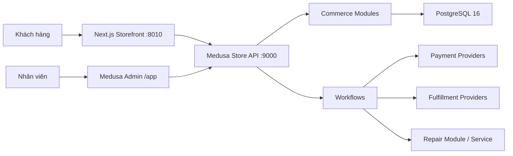

# Kiến trúc triển khai

## Ranh giới

- Medusa giữ catalog, variant/SKU, inventory/reservation, pricing/promotion, cart, order, payment, fulfillment và customer.
- Storefront chỉ gửi ý định mua; giá, khuyến mãi, tồn kho và tổng đơn được tính ở server.
- Mọi thay đổi nhiều bước dùng Medusa workflow để có transaction, compensation và idempotency thích hợp.
- Tích hợp bên ngoài dùng Payment/Fulfillment Provider hoặc custom module; không sửa core và không truy cập bảng Medusa bằng SQL trực tiếp.
- Repair là bounded context riêng. Nó tham chiếu customer/product/order qua Module Link thay vì gắn cột tùy ý vào schema core.

## Bất biến phải giữ

- SKU là duy nhất; tồn kho thay đổi qua inventory item, level và reservation.
- Không chấp nhận giá/tổng tiền do client gửi làm nguồn sự thật.
- Order lưu snapshot line item và amount tại thời điểm hoàn tất cart.
- Coupon claim, checkout, payment callback và webhook phải idempotent.
- Order, payment và fulfillment chỉ chuyển trạng thái qua workflow hợp lệ.
- Admin cần MFA; RBAC chi tiết, audit trail và cảnh báo hành vi nhạy cảm là extension bắt buộc trước production.

## Dữ liệu tiền

Medusa v2 dùng đơn vị tiền tệ chính. VND `22.990.000 ₫` được lưu là `22990000`, không nhân 100. Tính toán custom dùng `MathBN`, không dùng số thực JS cho quy tắc tiền phức tạp.
