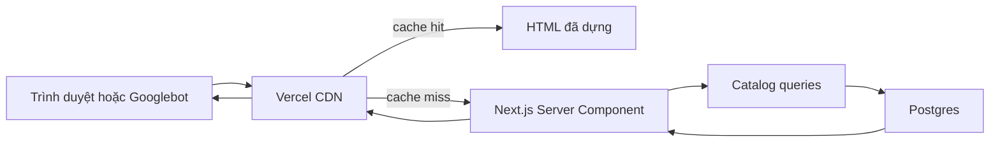
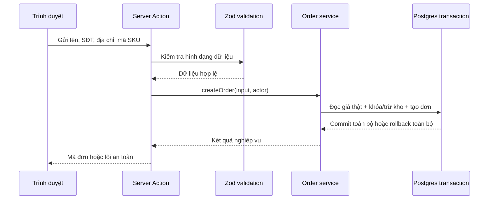

# M01 — Kiến trúc ứng dụng và vòng đời request

## Mục tiêu học

Sau module này, bạn cần nhìn một thao tác trên website và trả lời được bốn câu:

1. Ai khởi tạo thao tác?
2. Request đi qua những lớp nào?
3. Lớp nào được phép đọc hoặc thay đổi dữ liệu?
4. Hệ thống kiểm tra, ghi log và phục hồi ra sao nếu có lỗi?

M01 là bộ xương của hệ thống. Nó không quyết định giá một sản phẩm hay khi nào được trừ kho; những quy tắc đó thuộc các module nghiệp vụ. M01 chỉ quy định đường đi và luật giao tiếp để các module còn lại không trở thành một khối code lẫn lộn.

## 1. Mục đích nghiệp vụ

Với Điện Tử Hưng Phát, cùng một website phải phục vụ nhiều loại công việc:

- Khách xem sản phẩm nhanh và tìm thấy trên Google.
- Khách đặt hàng mà giá và tồn kho không bị sửa từ trình duyệt.
- Chủ cửa hàng cập nhật giá, tồn kho và trạng thái đơn an toàn.
- Cổng thanh toán gửi kết quả về mà không thể giả mạo hoặc xử lý trùng.
- Công việc nền gửi email, giải phóng tồn kho và sao lưu đúng lịch.

M01 tạo ra một con đường chuẩn cho từng loại công việc trên. Khi đường đi thống nhất, ta dễ kiểm thử, theo dõi lỗi, thay đổi công nghệ và bảo vệ dữ liệu hơn.

## 2. Người dùng và tác nhân

| Tác nhân | Việc thực hiện | Cách hệ thống nhận diện |
|---|---|---|
| Khách chưa đăng nhập | Xem sản phẩm, tìm kiếm, thêm giỏ, đặt hàng | Cookie phiên và dữ liệu form; không có quyền admin |
| Chủ cửa hàng | Quản lý sản phẩm, kho, đơn và sửa chữa | Phiên đăng nhập admin + MFA + quyền `owner` |
| Nhân viên tương lai | Xử lý một phần nghiệp vụ được giao | Phiên đăng nhập + quyền `staff` giới hạn |
| VNPay | Báo kết quả thanh toán | Chữ ký HMAC trên webhook/IPN, không dùng phiên đăng nhập |
| Vercel Cron | Kích hoạt công việc định kỳ | Secret riêng cho cron |
| Googlebot | Đọc trang công khai để lập chỉ mục | Request công khai; không có quyền ghi dữ liệu |

Điểm quan trọng: không phải tác nhân nào cũng đăng nhập. Webhook và cron được xác thực bằng bí mật/chữ ký riêng, còn trang công khai không cần xác thực nhưng vẫn phải giới hạn hành vi lạm dụng.

## 3. Dữ liệu

M01 không sở hữu bảng nghiệp vụ như `products`, `orders` hoặc `payments`. Nó sở hữu các quy ước và hạ tầng dùng chung:

| Thành phần | Vai trò | Ràng buộc quan trọng |
|---|---|---|
| Request context | Mã request, tác nhân, thời gian bắt đầu | Một request có một mã truy vết duy nhất |
| Error envelope | Chuẩn trả lỗi cho UI/API | Không lộ stack trace, secret hoặc thông tin nội bộ |
| Health result | Trạng thái app, DB, storage và job lag | Không trả secret hoặc chi tiết có ích cho kẻ tấn công |
| Cache tags | Nhãn như `product:{id}` và `category:{id}` | Chỉ làm mới phần liên quan khi dữ liệu đổi |
| Environment configuration | URL/khóa dịch vụ | Validate khi khởi động; khóa toàn quyền chỉ ở server |

Các bảng như `jobs`, `webhook_events` và `audit_logs` sẽ được đặc tả sâu ở M11, M08 và M10. M01 chỉ định nghĩa cách request gọi tới các module đó.

## 4. Luồng xử lý

### 4.1. Khách xem trang sản phẩm



Trang công khai ưu tiên render trên server để HTML có sẵn cho khách và công cụ tìm kiếm. Cache giúp phần lớn lượt xem không phải truy vấn database lại. Giá/tồn kho hiển thị có thể cũ trong một khoảng ngắn, nhưng checkout luôn tính và kiểm tra lại trên server.

### 4.2. Khách đặt hàng



Trình duyệt chỉ gửi ý định mua. Trình duyệt không được quyết định giá, tiền giảm hoặc số lượng tồn kho. `service` là nơi điều phối nghiệp vụ; database transaction bảo đảm hoặc tất cả bước cùng thành công, hoặc không bước nào được ghi nhận.

### 4.3. Admin sửa giá

```text
Admin form
  → kiểm tra phiên + MFA + quyền
  → validate dữ liệu
  → pricing service
  → transaction: cập nhật giá + ghi audit
  → commit
  → xóa đúng cache tag của sản phẩm
  → trả kết quả cho admin
```

Nếu cập nhật giá thành công nhưng audit thất bại, transaction phải rollback. Nếu database đã commit nhưng xóa cache lỗi, dữ liệu nguồn vẫn đúng; hệ thống ghi lỗi và cache sẽ hết hạn hoặc được làm mới lại.

### 4.4. VNPay gửi webhook/IPN

```text
VNPay
  → Route Handler nhận raw request
  → xác minh chữ ký trước khi tin payload
  → kiểm tra idempotency
  → payment service so số tiền/mã đơn với database
  → transaction cập nhật payment/order
  → trả acknowledgement nhanh cho VNPay
```

Trang `returnUrl` mà khách nhìn thấy không phải bằng chứng đã thanh toán. Chỉ webhook/IPN có chữ ký hợp lệ và khớp dữ liệu server mới được phép chuyển payment sang `paid`.

### 4.5. Cron xử lý job

```text
Vercel Cron
  → kiểm tra CRON_SECRET
  → claim một nhóm job bằng row lock
  → chạy handler có thể retry an toàn
  → success hoặc tăng attempts/dead-letter
  → ghi metric và log
```

## 5. Quy tắc bất biến

Các quy tắc này không được phá vỡ dù UI hoặc nhà cung cấp thay đổi:

1. Client không phải nguồn sự thật của giá, giảm giá, phí ship hoặc tồn kho.
2. Một thao tác nghiệp vụ nguyên tử phải nằm trong đúng một database transaction.
3. Module chỉ được ghi vào dữ liệu mình sở hữu; giao tiếp chéo qua service/port rõ ràng.
4. Business rule không được nằm trong React component, Route Handler hoặc ORM query rải rác.
5. Mọi input bên ngoài phải được validate trước khi vào nghiệp vụ.
6. `SUPABASE_SERVICE_ROLE_KEY` chỉ tồn tại ở server và không bao giờ vào client bundle/log.
7. Webhook phải xác minh chữ ký và idempotency trước khi thay đổi trạng thái.
8. Lỗi trả cho người dùng không được làm lộ secret, stack trace hoặc sự tồn tại của dữ liệu nhạy cảm.

Quy tắc dependency áp dụng theo hướng vào trong:

```text
UI / HTTP / Cron / Webhook
          ↓
Application service / use case
          ↓
Domain rules và ports
          ↑
Database, Supabase, email, payment adapters
```

Phần nghiệp vụ không import trực tiếp UI, Next.js, Supabase hay SDK cổng thanh toán. Adapter hạ tầng thực hiện các port mà nghiệp vụ yêu cầu.

## 6. Bảo mật

| Mối đe dọa | Ví dụ | Kiểm soát |
|---|---|---|
| Sửa dữ liệu từ client | Khách đổi giá trong DevTools | Server đọc giá lại từ DB và tính tổng |
| Lộ service-role key | Import nhầm client Supabase admin vào component | Tách module `server-only`, kiểm bundle/CI, không log env |
| Giả webhook | Gửi request giả báo đã thanh toán | Xác minh HMAC trên raw body, so amount/order, idempotency |
| CSRF | Website khác dụ browser gửi mutation | SameSite cookie, kiểm Origin, chỉ POST cho mutation; đánh giá thêm token ở endpoint nhạy cảm |
| Bot/spam | Gửi hàng nghìn checkout/tra cứu | Rate limit, Turnstile ở luồng phù hợp, alert quota |
| SSRF | User đưa URL khiến server gọi mạng nội bộ | Không fetch URL tùy ý; allowlist host nếu nghiệp vụ buộc phải tải |
| Cache poisoning/lộ dữ liệu | Cache trang có thông tin riêng của khách | Không cache nội dung phụ thuộc phiên/PII trong trang công khai |

Phân biệt quan trọng: xác thực trả lời “đây là ai”; phân quyền trả lời “người này được làm gì”; chống bot trả lời “hành vi này có vẻ là người thật hay lạm dụng”. Ba việc này không thay thế nhau.

## 7. Hiệu năng

- Storefront ưu tiên Server Components để giảm JavaScript gửi xuống điện thoại khách.
- CDN/ISR phục vụ nội dung đọc nhiều và ít thay đổi; mutation và dữ liệu cá nhân không cache chung.
- `revalidateTag` làm mới đúng sản phẩm/danh mục thay vì xóa toàn bộ cache.
- Mọi query phải có giới hạn; list API phải phân trang.
- Đo p50/p95/p99 thay vì chỉ nhìn một lần chạy nhanh trên máy dev.
- Khi chậm, đo request và query trước; không thêm Redis hoặc microservice theo cảm tính.

Mục tiêu ban đầu trong plan là storefront nhẹ và p95 render/query nằm trong ngân sách đã định. Đây là mục tiêu cần đo trong điều kiện cụ thể, không phải lời hứa mọi request luôn dưới một con số.

## 8. Lỗi thường gặp khi implement

1. Đặt business rule trong Server Action hoặc React component, khiến chỗ khác gọi lại không dùng được và khó test.
2. Tạo một file `utils.ts` khổng lồ dùng cho mọi module, làm ranh giới biến mất.
3. Import Supabase admin client vào code có thể chạy ở trình duyệt.
4. Tin tổng tiền hoặc trạng thái `paid` do client/return URL gửi lên.
5. Gọi nhiều thao tác DB liên tiếp nhưng không đặt trong một transaction.
6. Catch mọi lỗi rồi trả `Something went wrong`, làm mất khả năng quan sát nguyên nhân.
7. Log toàn bộ payload chứa SĐT, địa chỉ, token hoặc chữ ký.
8. Cache trang phụ thuộc cookie khách hàng như cache trang công khai.
9. Xóa/đổi schema và deploy code mới trong một bước, khiến phiên bản cũ đang chạy bị hỏng.
10. Tạo abstraction cho mọi thứ ngay từ đầu; chỉ tạo port ở ranh giới có ý nghĩa hoặc cần test/thay thế.

## 9. Test

| Cấp test | Mục tiêu | Ví dụ M01 |
|---|---|---|
| Unit | Business/use-case chạy không cần mạng hoặc DB thật | Tổng tiền client bị bỏ qua; lỗi chuẩn được map đúng |
| Integration | Kiểm tra ranh giới với DB/framework | Transaction rollback khi một bước thất bại; env validation |
| E2E | Kiểm tra hành trình qua UI và server | Trang công khai mở được; admin route chặn guest |
| Security | Thử phá invariant | Service key không có trong bundle; webhook sai chữ ký bị từ chối |
| Performance | Đo thay vì đoán | Lighthouse cho trang công khai; latency p95 của action/query |
| Recovery | Chứng minh phục hồi | Deploy rollback; migration tương thích phiên bản trước/sau |

Một kiến trúc dễ test là kiến trúc mà use case nhận dependency qua interface/port. Khi đó unit test dùng adapter trong bộ nhớ, không cần Supabase hoặc mạng thật.

## 10. Scale trigger

Chỉ xem xét đổi kiến trúc khi số liệu cho thấy vấn đề:

- p95 request động vượt ngân sách trong thời gian kéo dài.
- Query chậm đã được xác định bằng log và không giải quyết được bằng index/tối ưu.
- DB CPU hoặc connection thường xuyên gần giới hạn.
- Job backlog tăng liên tục nhanh hơn tốc độ xử lý.
- Nhiều người phát triển cùng một module gây xung đột/ràng buộc triển khai.

Thứ tự phản ứng: đo → sửa query/code → điều chỉnh cache/index → nâng tài nguyên → cuối cùng mới cân nhắc tách service.

## 11. Câu hỏi tự kiểm tra

Hãy trả lời bằng lời của bạn, không cần dùng thuật ngữ hoàn hảo:

1. Vì sao trình duyệt gửi `price = 1` nhưng đơn hàng vẫn phải dùng giá thật trong database?
2. Server Component khác Client Component ở đâu? Vì sao trang chi tiết sản phẩm nên ưu tiên Server Component?
3. Server Action, Route Handler, webhook và cron khác nhau ở tác nhân khởi tạo và cách xác thực thế nào?
4. Vì sao cập nhật đơn hàng và trừ kho phải cùng một transaction?
5. Vì sao một module không được tự ý ghi vào bảng của module khác?
6. Nếu admin vừa sửa giá nhưng khách vẫn thấy giá cũ 30 giây, checkout phải xử lý thế nào?
7. Vì sao `returnUrl` của VNPay không đủ để đánh dấu đơn đã thanh toán?
8. `service-role key` nguy hiểm hơn `anon key` ở điểm nào?
9. “Dependency hướng vào trong” nghĩa là gì trong dự án này?
10. Expand → migrate → contract giúp deploy an toàn như thế nào?

## Tóm tắt một câu

M01 bảo đảm mọi request đi đúng đường, nghiệp vụ nằm đúng chỗ, dữ liệu nhạy cảm chỉ được thay đổi sau khi kiểm tra ở server, và lỗi có thể được quan sát/phục hồi.
