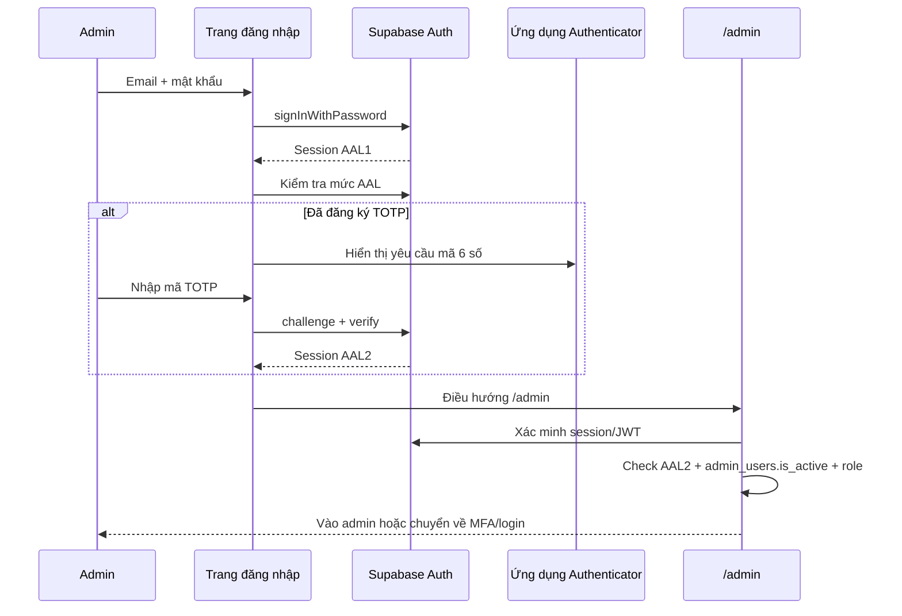
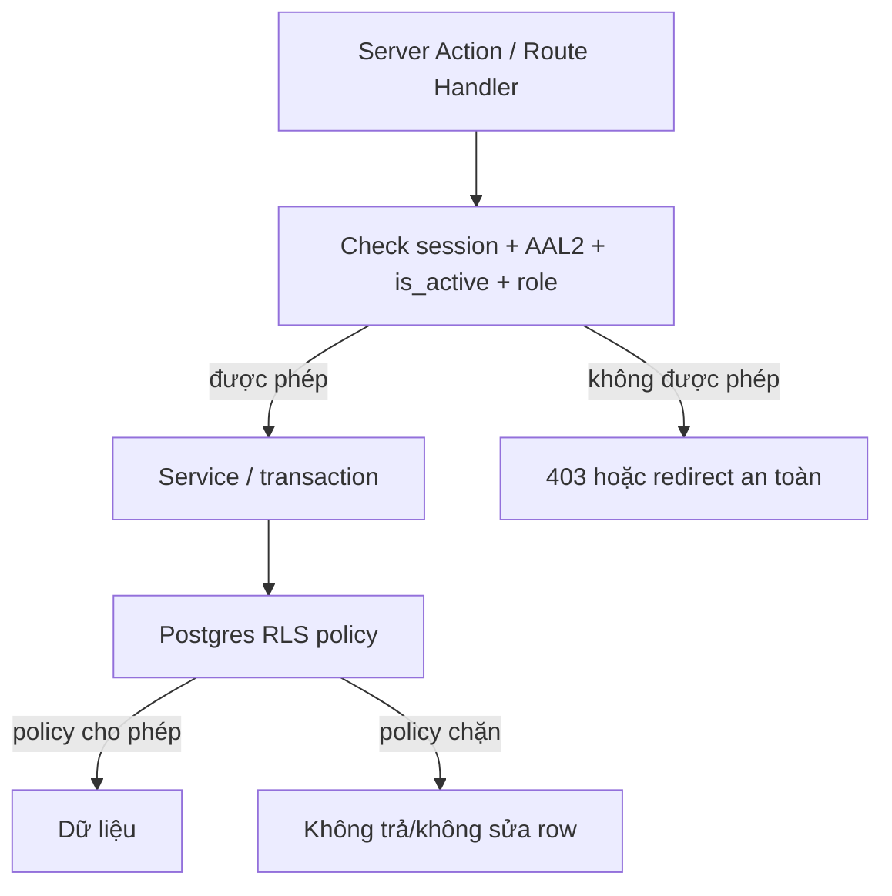

# M02 — Identity, Authentication, MFA và RBAC

## Mục tiêu học

Sau module này, bạn phải phân biệt rõ bốn câu hỏi:

1. Người đang dùng website là ai? (**Authentication / AuthN**)
2. Người đó được làm gì? (**Authorization / AuthZ**)
3. Họ đã chứng minh danh tính đủ mạnh chưa? (**MFA / AAL**)
4. Dù code ứng dụng có lỗi, database còn chặn được dữ liệu sai quyền không? (**RLS**)

M02 bảo vệ quyền admin của Điện Tử Hưng Phát. Khách mua hàng ở MVP không cần đăng nhập; admin thì phải dùng email, mật khẩu và TOTP.

## 1. Mục đích nghiệp vụ

Website không chỉ có “đăng nhập”. Nó phải đảm bảo:

- Chủ cửa hàng (`owner`) quản lý được toàn bộ sản phẩm, kho, đơn, nhân viên và cài đặt.
- Nhân viên (`staff`) chỉ xử lý việc được giao; không xem giá vốn, hoàn tiền, xuất dữ liệu khách hay tự tăng quyền.
- Nhân viên nghỉ việc bị chặn ngay ở request tiếp theo, dù trình duyệt của họ còn cookie cũ.
- Khách vãng lai chỉ được xem hàng và tạo guest checkout; không tự biến thành admin bằng cách sửa giao diện.
- Lịch sử ai đã đổi giá, hủy đơn hoặc xuất dữ liệu luôn truy vết được qua M10 Audit.

## 2. Người dùng và vai trò

| Tác nhân | Có đăng nhập? | Quyền chính |
|---|---:|---|
| `anonymous` | Không | Xem storefront, tìm kiếm, giỏ guest, checkout công khai |
| `owner` | Có + TOTP | Toàn bộ quyền quản trị, admin users, audit, refund, giá vốn, export dữ liệu |
| `staff` | Có + TOTP | CRUD sản phẩm/kho/đơn/phiếu sửa chữa theo quy định; không có quyền nhạy cảm của owner |
| `customer` | Phase 1.5 | Xem dữ liệu thuộc tài khoản của chính họ; MVP chưa dùng |
| Supabase Auth | Không phải người dùng | Lưu credential và phát hành session/JWT; không chứa logic phân quyền cửa hàng |

### Ma trận quyền MVP

| Hành động | owner | staff |
|---|:---:|:---:|
| Tạo/sửa sản phẩm, kho, đơn, phiếu sửa chữa | ✅ | ✅ |
| Xem giá vốn | ✅ | ❌ |
| Sửa giá hàng loạt, tạo khuyến mãi | ✅ | ❌ |
| Refund, hủy đơn đã giao | ✅ | ❌ |
| Quản lý admin users, settings, audit log | ✅ | ❌ |
| Xuất dữ liệu khách hàng | ✅ | ❌ |

Ẩn nút trên giao diện chỉ cải thiện UX. Quyền thật luôn được kiểm tra lại trên server ở từng action.

## 3. Dữ liệu

Supabase Auth quản lý bảng hệ thống `auth.users`: email, password hash, session, MFA factor. Ứng dụng **không tự tạo bảng password** và không tự lưu password.

Ứng dụng sở hữu bảng `admin_users`:

```text
admin_users
  id                uuid, primary key
  auth_user_id      uuid, unique, foreign key → auth.users.id
  role              owner | staff
  is_active         boolean
  invited_by        uuid, nullable → admin_users.id
  last_login_at     timestamptz, nullable
  created_at        timestamptz
  updated_at        timestamptz
```

| Dữ liệu | Vì sao cần | Ràng buộc |
|---|---|---|
| `auth_user_id` | Nối danh tính Supabase với quyền nghiệp vụ | Unique: một tài khoản Auth chỉ có một hồ sơ admin |
| `role` | Quyền theo vai trò | Chỉ enum `owner` hoặc `staff` |
| `is_active` | Tắt quyền ngay khi nghỉ việc | Luôn check ở server; không cache theo session |
| `invited_by` | Truy vết ai đã mời staff | Phục vụ audit |
| `last_login_at` | Phát hiện account lâu không dùng/lạ | Không dùng như bằng chứng quyền |

**Bất biến dữ liệu:** luôn phải còn ít nhất một `owner` đang active. Không cho owner cuối cùng tự deactivate hoặc đổi thành staff.

### Điểm thiết kế của luồng mời staff

Một người được mời có thể chưa tồn tại trong `auth.users` hoặc chưa chấp nhận email. Khi đó chưa thể có `auth_user_id` hợp lệ để gắn ngay vào `admin_users`.

Phương án khuyến nghị là tách lời mời đang chờ:

```text
admin_invites
  email, token_hash, invited_by, role, expires_at, accepted_at
          ↓ người được mời chấp nhận và tạo Auth user
admin_users
  auth_user_id, role, is_active
```

Phương án khác là cho `admin_users.auth_user_id` nullable trong trạng thái pending, nhưng phải thêm constraint/index phù hợp. Không được tạo token mời plaintext hoặc coi email đã gửi là bằng chứng người đó đã sở hữu tài khoản. Đây là quyết định schema cần chốt trước M0b.

### Khóa Supabase: tên cũ và tên mới

| Tên bạn có thể thấy | Ý nghĩa | Được phép ở browser? |
|---|---|:---:|
| `anon` (legacy) / `publishable` (mới) | Khóa nhận diện dự án, quyền thực tế bị RLS + JWT giới hạn | ✅ nếu RLS đúng |
| `service_role` (legacy) / `secret` (mới) | Khóa quyền cao có thể bypass RLS | ❌ tuyệt đối không |

Khóa publishable không phải password. Nó chỉ an toàn khi RLS bật và policy được viết đúng. Khóa secret/service-role là secret thật, chỉ dùng code server.

## 4. Luồng xử lý

### 4.1. Đăng nhập admin và MFA



`AAL1` nghĩa là đã qua yếu tố đăng nhập đầu tiên, như email + mật khẩu. `AAL2` nghĩa là session đã qua thêm yếu tố thứ hai, ở đây là TOTP. `/admin/*` chỉ chấp nhận AAL2.

### 4.2. Một action admin nhạy cảm

```text
Admin bấm “Đổi giá sản phẩm”
  → Server Action nhận input
  → validate input (format, giới hạn)
  → requireActiveAdmin()
  → requireAAL2()
  → requireRole('owner')
  → pricing service cập nhật trong transaction
  → audit service ghi actor_id, before/after
  → revalidate cache sản phẩm
  → trả kết quả an toàn
```

Nếu staff tự gọi Server Action bằng DevTools với payload giống owner, check server vẫn từ chối. UI không phải cửa bảo vệ.

### 4.3. Staff bị vô hiệu hóa

```text
Owner đặt is_active = false
  → ghi audit log
  → yêu cầu Supabase thu hồi phiên nếu API hỗ trợ cho luồng đó
  → mọi request admin tiếp theo vẫn query/check is_active
  → staff bị redirect/forbidden
```

Cookie cũ không tự tạo quyền vĩnh viễn. Session chứng minh danh tính; `admin_users.is_active` và role quyết định quyền hiện tại.

### 4.4. Hai lớp phân quyền



Lớp application nói: “owner có được refund đơn này không?” Lớp RLS nói: “kết nối hiện tại có được đọc/sửa row này không?” Chúng bổ sung nhau.

## 5. Quy tắc bất biến

1. Mọi route/action admin cần session hợp lệ, `AAL2`, `admin_users.is_active = true` và role phù hợp.
2. Check quyền phải chạy ở server **trong từng action**, không dựa vào nút đang ẩn/hiện.
3. Luôn còn ít nhất một owner active.
4. Password chỉ do Supabase Auth xử lý; app không tự lưu password hoặc password hash.
5. Secret/service-role key không xuất hiện trong browser, client bundle, URL, Git, screenshot hoặc log.
6. Session bị thu hồi/vô hiệu phải bị chặn ngay request kế tiếp bởi check `is_active`.
7. Thông báo login/reset password không tiết lộ email đó có tồn tại hay không.
8. Mọi thay đổi quyền, staff, recovery, export khách và thao tác owner nhạy cảm phải có audit log.

## 6. Bảo mật

| Đe dọa | Ví dụ | Kiểm soát |
|---|---|---|
| Credential stuffing | Bot thử email/mật khẩu rò rỉ từ nơi khác | Rate limit theo IP + email, thông báo chung, MFA bắt buộc |
| Brute force TOTP | Thử liên tục mã 6 số | Giới hạn challenge/verify và khóa tạm thời theo chính sách |
| Leo thang quyền | Staff gọi action owner hoặc sửa role trong request | `requireRole` server-side mỗi action; role không lấy từ client |
| Trộm session | XSS đọc token, máy công cộng giữ cookie | Cookie `HttpOnly`, `Secure`, `SameSite`; không localStorage/token URL; đăng xuất và thu hồi session |
| Email enumeration | Form báo “email này không tồn tại” | Trả cùng một thông báo cho sai email/mật khẩu/reset |
| Lộ secret key | Commit `.env`, import nhầm vào client | `server-only`, secret manager/env, secret scanning, review bundle/log |
| Bypass RLS | Policy quên bật/chọn sai hoặc view bypass policy | RLS default-deny, test anon/authenticated, review policy và view |
| Mất thiết bị TOTP | Owner mất điện thoại Authenticator | Đăng ký TOTP factor dự phòng trên thiết bị/app khác; nếu mất toàn bộ factors thì dùng quy trình hỗ trợ/owner được xác minh trong RUNBOOK |
| Phishing MFA | Kẻ xấu dụ nhập password + TOTP realtime | Không có biện pháp tuyệt đối với TOTP; cảnh báo login lạ, đào tạo, kiểm tra domain |

## 7. Hiệu năng

- JWT/session được xác minh ở ranh giới request; không gọi mạng vô ích chỉ để render từng component.
- Thông tin admin và role được dùng trong phạm vi một request, không biến thành cache công khai.
- RLS policy phải có index cho cột policy hay lọc, như `auth_user_id`, để tránh chậm khi dữ liệu tăng.
- Không cache kết quả `is_active` lâu: nếu staff bị tắt quyền, cache lâu sẽ thành lỗ hổng.

## 8. Lỗi thường gặp khi implement

1. Chỉ chặn route `/admin` nhưng quên check quyền trong Server Action/API.
2. Ẩn nút “Refund” với staff rồi tưởng là đủ bảo mật.
3. Tự tạo bảng password hoặc log password/reset token.
4. Đưa access token/secret vào `localStorage`, URL hoặc console log.
5. Dùng `service_role`/secret key cho code browser để “đỡ vướng RLS”.
6. Viết RLS `USING (true)` cho bảng nhạy cảm để test rồi quên gỡ.
7. Quên kiểm `is_active` sau khi người dùng đã có session.
8. Để owner cuối cùng tự xóa/đổi quyền, khiến không còn ai quản trị.
9. RLS chặn row nhưng service dùng secret key bypass RLS mà không có authorization riêng.
10. Bắt buộc MFA nhưng không đăng ký factor dự phòng hoặc runbook, khiến owner tự khóa mình.

## 9. Test

| Cấp test | Điều phải chứng minh |
|---|---|
| Unit | `requireRole('owner')` chặn staff; owner cuối cùng không bị deactivate; lỗi login được map chung chung |
| Integration | RLS chặn publishable/anon client đọc `admin_users`; policy đúng cho actor hợp lệ; secret chỉ dùng server |
| E2E | Password → TOTP → vào admin; session AAL1 bị chuyển tới MFA; staff bị deactivate và request tiếp theo bị chặn |
| Security | Gọi action owner bằng session staff bị 403; sửa role trong payload không tác dụng; key/secret không xuất hiện trong client bundle |
| Recovery | Factor TOTP dự phòng được kiểm thử; mất toàn bộ factor có runbook và audit record |

## 10. Scale trigger

- Có hơn khoảng 5 staff hoặc cần quyền tinh hơn `owner/staff`: cân nhắc bảng permissions thay vì chỉ enum role.
- Nhiều chi nhánh: thêm scope location/branch vào permission, không thêm role chắp vá như `staff_branch_3`.
- Có customer account: tách quyền customer khỏi admin; không để customer chung bảng `admin_users`.
- Có yêu cầu doanh nghiệp/SSO: đánh giá lại Supabase plan/identity provider, nhưng business rule `requireRole` vẫn giữ nguyên.

## 11. Câu hỏi tự kiểm tra

1. Authentication và Authorization khác nhau thế nào? Nêu ví dụ owner/staff.
2. Vì sao admin password đúng nhưng AAL1 vẫn không được vào `/admin`?
3. AAL1 và AAL2 là gì?
4. Vì sao ẩn nút owner trên UI không phải là phân quyền?
5. RLS bảo vệ cái gì, và vì sao nó không thay server-side `requireRole`?
6. Publishable/anon key khác secret/service-role key thế nào?
7. Vì sao phải check `is_active` mỗi request admin thay vì chỉ lúc login?
8. Nếu owner cuối cùng tự deactivate, chuyện gì xảy ra và hệ thống phải chặn thế nào?
9. Vì sao nên có TOTP factor dự phòng trên thiết bị/app khác, và không nên tự xây recovery-code bypass?
10. Nếu staff thay payload `role: 'owner'` trong DevTools, điều gì phải chặn họ?

## Tóm tắt một câu

M02 biến “đã đăng nhập” thành “đúng người, đủ xác minh, còn active và đúng quyền mới được làm hành động nhạy cảm”.
