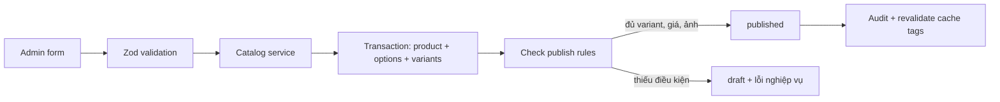

# M03 — Catalog, Category, Product, Variant và SKU

## Mục tiêu học

M03 là nguồn sự thật về **cửa hàng bán cái gì và mô tả nó ra sao**. Sau module này, bạn phải phân biệt được Product, Variant và SKU; biết giá/tồn kho thuộc module nào; hiểu vì sao sản phẩm đã bán chỉ archive chứ không hard-delete.

## 1. Mục đích nghiệp vụ

Điện Tử Hưng Phát có nhiều ngành hàng với thông số khác nhau:

- TV: hãng, kích thước, độ phân giải.
- Điện thoại: màu, dung lượng, RAM.
- Tủ lạnh: hãng, dung tích, số cửa.
- Linh kiện: socket, công suất, chuẩn kết nối.

Catalog phải hỗ trợ category, brand, product, option, variant, ảnh, thông số, slug, draft/published/archive và import CSV mà không biến mỗi ngành thành một hệ thống riêng.

## 2. Người dùng và tác nhân

| Tác nhân | Đọc | Ghi |
|---|---|---|
| Khách/Googlebot | Product đã published, variant active, thông số công khai | Không |
| Staff | Catalog theo quyền, không thấy giá vốn | Tạo/sửa theo quyền |
| Owner | Toàn bộ catalog và cost price | Publish, archive, import, bulk update |
| Inventory | Đọc variant/SKU để tham chiếu | Không sửa nội dung catalog |
| Pricing | Đọc giá cơ sở của variant | Không sở hữu product |
| Search/SEO | Đọc dữ liệu public để index | Không tự sửa nguồn catalog |

Ẩn `cost_price` phải làm ở query/server boundary, không chỉ bằng CSS hoặc ẩn cột trên UI.

## 3. Dữ liệu

### 3.1. Quan hệ

```text
Category ──< Product >── Brand
               │
               ├──< ProductOption ──< OptionValue
               ├──< ProductVariant (SKU, giá cơ sở)
               │                    └── Inventory tham chiếu ở M04
               └──< ProductImage (metadata; file ở M13)
```

### 3.2. Bảng chính

| Bảng | Trách nhiệm | Ràng buộc chính |
|---|---|---|
| `categories` | Nhóm sản phẩm | slug unique, parent không tự trỏ, depth tối đa 3 |
| `brands` | Hãng sản xuất | slug unique |
| `products` | Nhóm sản phẩm khách nhìn thấy | category, brand, name, slug, specs, status |
| `product_options` | Trục biến thể | Ví dụ Màu, Dung lượng |
| `product_option_values` | Giá trị trục | Ví dụ Titan, 256GB |
| `product_variants` | Đơn vị bán cụ thể | SKU unique, combo option unique, giá |
| `product_images` | Metadata ảnh | alt bắt buộc, position, có thể gắn variant |
| `slug_redirects` | Link cũ | old_slug unique, redirect tới slug mới |

Tiền dùng `bigint` VND, không dùng số thực. `cost_price` là dữ liệu nhạy cảm chỉ owner được xem.

### 3.3. Product, Variant và SKU

Product là nhóm khách nhìn thấy:

```text
iPhone 15 Pro Max
```

Variant là phiên bản bán cụ thể:

```text
iPhone 15 Pro Max / Titan / 256GB  → SKU IP15PM-TI-256
iPhone 15 Pro Max / Titan / 512GB  → SKU IP15PM-TI-512
iPhone 15 Pro Max / Đen / 256GB    → SKU IP15PM-BK-256
```

SKU là mã duy nhất của một variant để bán và quản kho. Mỗi variant có thể có giá, barcode, khối lượng và tồn kho riêng. Product chỉ gom các variant thành một trang.

Sản phẩm không có option vẫn cần một variant mặc định:

```text
Product: Nồi cơm điện Sharp 1.8L
Variant: DEFAULT / SKU-NOI-SHARP-18L
```

Nhờ vậy Cart, Order và Inventory luôn tham chiếu `variant_id`, không cần một nhánh logic riêng cho sản phẩm “không có variant”.

### 3.4. Điểm thiết kế lời mời staff

Catalog không sở hữu việc mời staff, nhưng M03 phải hiểu vì sao dữ liệu không được trộn bừa: Product/Variant là catalog; `auth_user_id` là Identity; tồn kho là Inventory; ảnh vật lý là Media.

## 4. Luồng xử lý

### 4.1. Admin tạo và xuất bản



Tạo product chưa có nghĩa khách nhìn thấy. Product chỉ được published khi có variant active, giá hợp lệ và ảnh/metadata cần thiết.

### 4.2. Hai option thành sáu variant

```text
Màu: Titan, Đen, Xanh
Dung lượng: 256GB, 512GB
→ 3 × 2 = 6 tổ hợp
→ mỗi tổ hợp một variant và một SKU
```

`combo_key` là tổ hợp option đã chuẩn hóa. Unique `(product_id, combo_key)` chặn tạo trùng cùng màu/dung lượng.

### 4.3. Đổi slug

```text
/san-pham/iphone-15-pro-max
  → đổi slug
  → cùng transaction ghi slug mới + slug_redirects
  → URL cũ trả 301 tới URL mới
  → revalidate cache product/category
```

Nếu đổi slug mà không tạo redirect, link Google/Facebook cũ sẽ thành 404.

### 4.4. Import CSV

```text
CSV upload → parse/validate từng dòng → batch_id
          → dòng hợp lệ được ghi
          → dòng lỗi trả report (số dòng + lý do)
          → audit lưu batch_id và before/after
```

MVP có thể import 197/200 dòng và báo 3 dòng lỗi. Chế độ strict sẽ rollback toàn batch nếu owner yêu cầu.

## 5. Quy tắc bất biến

1. `published` phải có ít nhất một variant active, giá hợp lệ và ảnh/metadata bắt buộc.
2. SKU unique toàn catalog.
3. Một product không có hai variant trùng tổ hợp option.
4. Product/variant đã có trong order không được hard-delete; chỉ archive/deactivate.
5. Đổi slug phải ghi `slug_redirects` trong cùng transaction.
6. Catalog không tự quyết tồn kho; M04 sở hữu số lượng.
7. Staff không được nhận `cost_price` trong query/API response.
8. Option phải canonicalize để đổi thứ tự JSON không tạo combo khác.
9. Category không được tự trỏ hoặc tạo vòng lặp parent-child.
10. Mọi mutation qua server validation và service; không tin `price`, `status`, `is_published` từ client.

## 6. Bảo mật

| Đe dọa | Ví dụ | Kiểm soát |
|---|---|---|
| XSS mô tả | Admin đưa script vào description HTML | Sanitize server-side bằng allowlist; cấm script/style/iframe/on* |
| Lộ giá vốn | Staff xem response dù UI ẩn | Query không select cost_price; test response |
| Mass assignment | Client gửi thêm cost_price/status | Input allowlist theo action; service tự quyết field |
| Slug abuse | Ký tự lạ/trùng/đường dẫn nguy hiểm | Normalize allowlist `[a-z0-9-]`, unique, redirect |
| CSV formula injection | Ô bắt đầu bằng `=`, `+`, `-`, `@` | Escape/report an toàn khi export; validate text |
| Lộ draft | Public query lấy mọi status | Query public bắt buộc published + active variant |
| Ảnh độc hại | SVG/polyglot upload | M13 kiểm magic bytes, allowlist, re-encode, storage policy |

## 7. Hiệu năng

- Index truy vấn thật: `(category_id, status)`, brand, slug, SKU.
- PDP và listing dùng ISR/cache tag; admin sửa thì làm mới đúng product/category.
- Listing phân trang, không trả toàn bộ catalog.
- `specs` JSONB linh hoạt cho đa ngành; chỉ thêm index khi có query đo được.
- Search FTS/trigram thuộc M12; Catalog chỉ cung cấp dữ liệu và tín hiệu reindex.
- Không denormalize số lượng sản phẩm trong category trước khi đo query.

## 8. Lỗi thường gặp khi implement

1. Lưu giá/tồn kho ở product thay vì variant.
2. Không tạo variant mặc định cho sản phẩm không có option.
3. Hard-delete sản phẩm đã nằm trong order.
4. Chỉ ẩn `cost_price` bằng UI.
5. Đổi slug nhưng không tạo redirect.
6. Đưa description HTML ra browser mà không sanitize.
7. Tạo combo trùng do không canonicalize option.
8. Import CSV không có report dòng lỗi hoặc batch id.
9. Public query thấy draft/archived.
10. Để Catalog tự trừ kho hoặc tự xử lý khuyến mãi.

## 9. Test

| Cấp test | Ví dụ |
|---|---|
| Unit | Normalize slug, canonicalize combo key, publish rule |
| Integration | Unique SKU/combo, category không vòng lặp, đổi slug + redirect cùng transaction |
| E2E | Tạo product 2 option → 6 variant → publish → storefront đúng |
| Security | Staff không nhận cost price; public không thấy draft; script bị sanitize |
| Import | 200 dòng có 3 lỗi → report đúng; strict mode rollback đúng |
| Regression | Archive product → order cũ vẫn hiển thị snapshot tên/giá |

## 10. Scale trigger

- Trên khoảng 10.000 SKU hoặc search/facet chậm đo được: đánh giá Meilisearch.
- Filter JSONB chậm: cân nhắc schema thuộc tính chuẩn hóa/EAV, không làm trước số liệu.
- Nhiều admin sửa cùng product: thêm version/optimistic concurrency và audit batch.
- Nhiều ngành có template phức tạp: chuẩn hóa attribute theo category.

## 11. Câu hỏi tự kiểm tra

1. Product khác Variant khác SKU thế nào?
2. Vì sao sản phẩm không có option vẫn cần một variant mặc định?
3. Vì sao giá và tồn kho gắn với variant thay vì chỉ Product?
4. Vì sao Product đã có trong order chỉ archive chứ không hard-delete?
5. Vì sao Catalog không được tự sở hữu số lượng tồn kho?
6. `combo_key` giải quyết lỗi gì?
7. Khi đổi slug, vì sao phải ghi `slug_redirects` cùng transaction?
8. Vì sao không được chỉ ẩn `cost_price` bằng giao diện?
9. Product muốn chuyển sang published cần kiểm tra gì?
10. Import CSV có 3 dòng lỗi thì hệ thống nên phản hồi thế nào?

## Tóm tắt một câu

Catalog định nghĩa “bán cái gì”; Product là nhóm khách nhìn thấy, Variant là phiên bản cụ thể, SKU là mã định danh đơn vị bán — còn khuyến mãi và tồn kho thuộc module khác.
