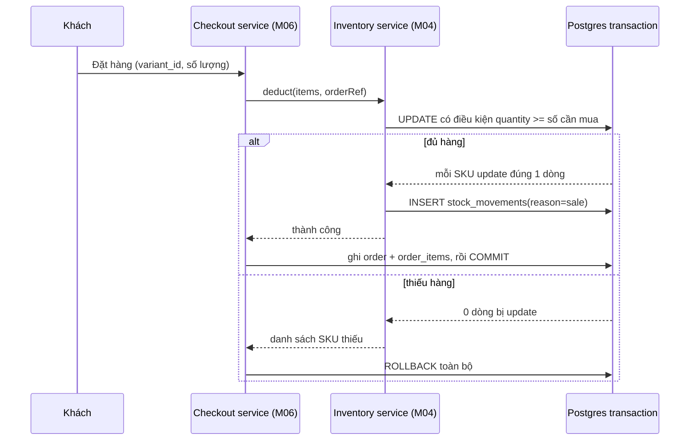

# M04 — Inventory và Stock Movements

## Mục tiêu học

M04 trả lời hai câu khác nhau nhưng phải luôn khớp nhau: **"hiện còn bao nhiêu?"** và **"vì sao lại còn từng đó?"**. Sau module này, bạn phải hiểu vì sao tồn kho không chỉ là một con số; biết chặn oversell khi nhiều người mua cùng lúc; và biết tại sao Catalog hay Order không được tự `UPDATE` kho.

## 1. Mục đích nghiệp vụ

Điện Tử Hưng Phát cần quản lý từ điện thoại, điện gia dụng đến linh kiện sửa chữa. Hệ thống phải cho phép:

- Nhập 20 máy về kho.
- Hai khách cùng mua chiếc cuối cùng nhưng chỉ một người thành công.
- Hoàn lại kho khi đơn COD/VietQR bị hủy hoặc VietQR quá hạn chưa trả tiền.
- Điều chỉnh khi kiểm kho thực tế lệch, luôn có lý do và người chịu trách nhiệm.
- Xuất linh kiện để sửa chữa mà vẫn truy được lịch sử.

Tồn kho đúng giúp không bán quá số hàng có thật, không mất dấu hàng và không phải "đoán" khi kiểm kho.

## 2. Người dùng và tác nhân

| Tác nhân | Cần gì từ M04 | Được làm gì |
|---|---|---|
| Khách | Biết còn hàng/sắp hết/hết hàng | Chỉ đọc trạng thái công khai; không được trừ kho |
| Checkout (M06) | Trừ kho cho đơn hợp lệ | Gọi `inventory.deduct`, không chạm bảng trực tiếp |
| Orders (M07) | Hoàn kho khi transition hủy hợp lệ | Gọi `inventory.restock`, không chạm bảng trực tiếp |
| Staff kho | Nhập hàng, kiểm kho | `receiveStock`; điều chỉnh theo quyền và có ghi chú |
| Owner | Kiểm soát thất thoát, duyệt điều chỉnh | Xem toàn bộ ledger/audit, điều chỉnh theo quyền cao hơn |
| Job nền | Tự hoàn đơn treo, đối chiếu số dư | Chỉ gọi use case của M04 với identity dịch vụ |

`product_variants` của M03 định nghĩa **món nào**; M04 định nghĩa **món đó còn bao nhiêu ở đâu**.

## 3. Dữ liệu

### 3.1. Quan hệ

```text
ProductVariant (M03)
       │
       ├── Inventory ── Location
       │     "số dư hiện tại"
       │
       └── StockMovement
             "sao kê mọi lần tăng/giảm"
```

### 3.2. Bảng chính

| Bảng | Vai trò | Ràng buộc chính |
|---|---|---|
| `locations` | Địa điểm giữ hàng | MVP chỉ một dòng nhưng có sẵn để mở chi nhánh sau này |
| `inventory` | Số dư hiện tại theo `variant + location` | `quantity >= 0`, unique `(variant_id, location_id)` |
| `stock_movements` | Sổ cái mọi biến động | `delta != 0`, reason hợp lệ, append-only, có tham chiếu nghiệp vụ |

Khung dữ liệu:

```text
locations(id, name, address, is_active)

inventory(
  id, variant_id, location_id,
  quantity int NOT NULL CHECK (quantity >= 0),
  low_stock_threshold int NOT NULL DEFAULT 3,
  UNIQUE(variant_id, location_id)
)

stock_movements(
  id, variant_id, location_id,
  delta int NOT NULL,                         -- + tăng, - giảm
  reason: initial|purchase|sale|cancel_restock|adjustment|repair_part,
  ref_type text, ref_id uuid,                 -- ví dụ order / id đơn
  actor_id uuid NULL, note text,
  created_at
)
```

`inventory.quantity` là **số dư vật chất hóa**: đọc rất nhanh để hiển thị và checkout. `stock_movements` là **ledger/sổ cái append-only**: lịch sử để giải trình, audit và có thể dựng lại số dư. Giống tài khoản ngân hàng có số dư hiện tại và sao kê giao dịch.

Ví dụ một SKU ở kho Long Khánh:

| Thời điểm | Lý do | Delta | Số dư sau |
|---|---:|---:|---:|
| Nhập ban đầu | `initial` | +20 | 20 |
| Bán đơn `O-101` | `sale` | -1 | 19 |
| Hủy đơn `O-101` | `cancel_restock` | +1 | 20 |
| Kiểm kho vỡ hộp | `adjustment` | -1 | 19 |

## 4. Luồng xử lý

### 4.1. Trừ kho trong checkout



Hai thao tác "giảm số dư" và "ghi movement" phải ở **cùng transaction** với việc tạo đơn. Nếu một bước thất bại, tất cả quay lại trạng thái ban đầu.

### 4.2. Ngăn race condition ở chiếc cuối cùng

Sai — đọc rồi mới ghi:

```text
A đọc quantity = 1
B đọc quantity = 1
A ghi quantity = 0
B cũng ghi quantity = 0
→ hệ thống nhận 2 đơn nhưng chỉ có 1 hàng: oversell
```

Đúng — một lệnh cập nhật nguyên tử có điều kiện:

```sql
UPDATE inventory
SET quantity = quantity - :requested_quantity
WHERE variant_id = :variant_id
  AND location_id = :location_id
  AND quantity >= :requested_quantity;
```

Database khóa dòng cần thay đổi trong lúc xử lý. Một request thắng sẽ làm quantity thành 0; request còn lại chỉ cập nhật được 0 dòng, từ đó service trả lỗi hết hàng. Không dùng số lượng mà browser gửi để ghi thẳng vào DB.

### 4.3. Hoàn kho

```text
Đơn chuyển sang canceled/expired theo state machine M07/M08
→ service gọi inventory.restock(items, orderRef, cancel_restock)
→ tăng số dư + ghi movement dương cùng transaction
→ chỉ transition hủy hợp lệ lần đầu mới được hoàn kho
```

Không được gọi `restock` trực tiếp từ nút UI. Nếu người dùng bấm hủy hai lần hoặc job chạy lại, state machine và tham chiếu `ref_type/ref_id` phải giúp phát hiện/không tạo lần hoàn kho thứ hai.

### 4.4. Nhập và điều chỉnh kho

```text
Staff có quyền → validate quantity dương, location, note
  → receiveStock: +delta, reason=purchase
  → hoặc adjust: +/-delta, reason=adjustment, note bắt buộc
  → transaction tăng/giảm inventory + append movement + audit
```

Điều chỉnh không phải cách bán hàng bình thường; nó dành cho chênh lệch thực tế, hư hỏng, mất hàng. Vì vậy note và actor bắt buộc để owner có thể kiểm tra.

## 5. Quy tắc bất biến

1. Với từng `(variant_id, location_id)`, `inventory.quantity` phải bằng tổng `stock_movements.delta` sau khi tính mốc tồn đầu kỳ phù hợp.
2. Không âm kho. Database có `CHECK (quantity >= 0)` là chốt cuối; service phải dùng update nguyên tử để chặn trước đó.
3. Mọi thay đổi số dư phải đồng thời tạo đúng một `stock_movement` cùng transaction.
4. `stock_movements` chỉ thêm mới, không `UPDATE` hay `DELETE`. Sửa sai bằng movement điều chỉnh mới, không xóa lịch sử.
5. Chỉ M04 được ghi `inventory` và `stock_movements`; module khác gọi use case/port của M04.
6. Mỗi item trừ kho có quantity nguyên dương và trong giới hạn nghiệp vụ (MVP: tối đa 100/món/đơn).
7. Một lần hủy/hết hạn đơn chỉ hoàn kho một lần.
8. MVP trừ kho ngay khi tạo đơn; đơn chưa thanh toán bị hết hạn sẽ tự hoàn sau 60 phút.
9. Adjustment phải có `actor_id`, `note`, lý do; không có API public cho adjustment/deduct/restock.
10. Tồn kho hiển thị cho khách là trạng thái (còn/sắp hết/hết), không phải số chính xác.

## 6. Bảo mật

| Rủi ro | Ví dụ | Kiểm soát |
|---|---|---|
| Client sửa tồn kho | Gọi action/API bằng DevTools với số lượng âm | Không có endpoint public ghi kho; validate server; DB constraints |
| Oversell/race | Hai request mua cùng SKU cuối | Atomic conditional update trong transaction; race integration test |
| Hoàn kho hai lần | Bấm hủy hai lần, webhook/job retry | State machine + idempotency theo ref/order + movement đối chiếu |
| Gian lận nội bộ | Staff tự tăng/giảm kho để che thất thoát | Role, actor, note bắt buộc, audit log, owner review |
| Bot giam hàng | Spam đơn VietQR rồi bỏ | Rate limit, Turnstile, auto-release 60 phút, chặn khách lạm dụng |
| Lộ dữ liệu vận hành | Public API trả số lượng chính xác | Public query chỉ trả availability, staff query theo role |

Service role/secret key (nếu sau này có job nền) chỉ ở server. Browser không bao giờ có quyền trực tiếp sửa hai bảng này.

## 7. Hiệu năng

- `inventory` truy vấn theo unique `(variant_id, location_id)`, nên giảm/tăng kho là thao tác rất nhanh.
- Index `stock_movements(variant_id, created_at)` cho lịch sử SKU; `(ref_type, ref_id)` cho truy ngược từ đơn.
- Transaction checkout phải ngắn: không gửi email, không gọi cổng thanh toán/API vận chuyển bên trong transaction vì giữ lock lâu sẽ làm request khác chờ.
- Gộp và sắp xếp items theo quy tắc cố định trước khi khóa nhiều SKU để giảm nguy cơ deadlock khi giỏ có nhiều món.
- Dashboard low-stock đọc số dư; job đối chiếu ledger chạy nền ban đêm, không chạy trong request mua hàng.

## 8. Lỗi thường gặp khi implement

1. `SELECT quantity` trong app rồi mới `UPDATE` theo giá trị đã đọc.
2. Để Cart/Order/Catalog tự `UPDATE inventory` thay vì gọi M04.
3. Chỉ giảm `quantity` mà quên ghi `stock_movement`, hoặc ngược lại.
4. Xóa/sửa movement cũ để "làm đẹp" lịch sử.
5. Hoàn kho khi chưa kiểm transition hủy, dẫn đến hoàn hai lần.
6. Gọi email/VNPay/GHN trong transaction giữ row lock.
7. Tin `variant_id`, location hay quantity từ client mà không kiểm tra server-side.
8. Cho staff adjustment không có note/actor/audit.
9. Hiển thị số tồn chính xác công khai dù không cần thiết.
10. Thêm `reserved` quá sớm; MVP đã chọn trừ ngay + auto-release để giảm trạng thái phải đồng bộ.

## 9. Test

| Cấp test | Ví dụ bắt buộc |
|---|---|
| Unit | Tính delta, validate quantity, phân loại availability theo threshold |
| Integration | `deduct` đủ hàng tạo movement âm; thiếu hàng không tạo order/movement dở dang |
| Race integration | Hai connection thật cùng mua 1 chiếc → đúng 1 thành công, số dư cuối = 0 |
| Integration | Hủy đúng một lần → hoàn đúng một lần; retry không tăng lần hai |
| Ledger reconciliation | Tổng movements khớp `inventory.quantity`; cố tình lệch phải có alert |
| E2E | Nhập 20 → bán 1 → hủy → số dư quay về 20 |
| Security | Staff không đủ quyền không thể adjust; browser không thể gọi đường ghi kho trực tiếp |

## 10. Scale trigger

| Dấu hiệu | Hướng nâng cấp |
|---|---|
| Mở chi nhánh thứ hai | Thêm/chọn `locations`; phân bổ hàng theo kho, schema đã sẵn |
| Trên ~200 đơn/ngày kèm flash-sale/tranh mua cao | Đánh giá reservation: `available`, `reserved`, TTL, job dọn; chỉ thêm khi đo được cần thiết |
| Có POS tại quầy | POS cũng phải gọi `deduct` với `ref_type='pos'`, không tạo đường trừ kho riêng |
| Nhiều điều chỉnh hoặc nghi thất thoát | Tăng tần suất reconciliation, quy trình owner review và báo cáo audit |
| Lock wait/deadlock đo được | Rà transaction ngắn, thứ tự khóa SKU, retry có giới hạn và quan sát metric |

## 11. Câu hỏi tự kiểm tra

1. `inventory.quantity` và `stock_movements` khác vai trò ra sao?
2. Vì sao kho cần vừa có số dư hiện tại vừa có ledger append-only?
3. Hai khách mua chiếc cuối cùng thì luồng nào phải thành công và vì sao?
4. Vì sao `UPDATE ... WHERE quantity >= n` an toàn hơn `SELECT` rồi `UPDATE`?
5. Vì sao không được gửi email hay gọi API thanh toán khi transaction đang giữ row lock?
6. Nếu đơn VietQR quá hạn thì M04 làm gì, và làm sao tránh hoàn kho hai lần?
7. Vì sao Catalog/Order không được tự ghi bảng inventory?
8. Adjustment cần những dữ liệu nào ngoài số lượng, và vì sao?
9. Nếu hàng thực tế mất một chiếc, có được xóa movement cũ không? Cách đúng là gì?
10. Khi nào mới đáng thêm mô hình reservation thay vì trừ kho ngay?

## Tóm tắt một câu

Inventory là số dư nhanh để vận hành; stock movements là sổ cái không sửa để giải trình — mọi tăng/giảm phải đi qua một service, một transaction và một update nguyên tử.
