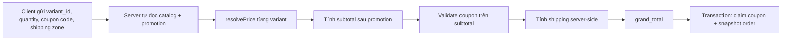

# M05 — Pricing, Promotion và Coupon

## Mục tiêu học

M05 là nơi duy nhất trả lời: **"SKU này, vào thời điểm này, khách này phải trả bao nhiêu?"**. Sau module này, bạn phải biết tách giá gốc với giá bán cuối; hiểu vì sao browser không được quyết định giá; và chặn việc hai khách cùng lấy lượt coupon cuối.

## 1. Mục đích nghiệp vụ

Điện Tử Hưng Phát cần đặt giá và khuyến mãi an toàn cho nhiều ngành hàng:

- Galaxy S25 giá gốc 24.990.000₫, sale còn 22.990.000₫ trong thời gian xác định.
- Giảm 5% nhóm Phụ kiện.
- Mã `KHAITRUONG` giảm 100.000₫ cho đơn từ 2.000.000₫, tối đa 100 lượt, mỗi số điện thoại một lượt.
- Khách nhìn thấy giá ở giỏ lúc 23:59 nhưng gửi đơn lúc 00:00, khi chương trình đã hết hạn.

M05 giữ một nguồn sự thật để trang sản phẩm, giỏ hàng, checkout và Order không tự tính theo những cách khác nhau.

## 2. Người dùng và tác nhân

| Tác nhân | Cần gì | Được làm gì |
|---|---|---|
| Khách | Xem giá cuối dự kiến, dùng mã hợp lệ | Chỉ gửi coupon code/giỏ; không gửi giá để server tin |
| Owner | Tạo/tắt/sửa promotion và coupon | Owner-only, mọi thay đổi có audit |
| Staff | Xem giá/chương trình đang áp dụng | Không tạo hoặc sửa mã/khuyến mãi |
| Catalog (M03) | Cung cấp giá gốc của variant | Không tự áp promotion |
| Cart/Checkout (M06) | Cần tính preview và chốt giá | Gọi `resolvePrice`/`priceOrder` |
| Orders (M07) | Cần snapshot giá của đơn | Nhận kết quả chốt, không tự tính lại đơn cũ |

## 3. Dữ liệu

### 3.1. Quan hệ sở hữu

```text
M03 ProductVariant (base_price)
              │ đọc
              ▼
M05 Pricing ── Promotions ── Coupons ── CouponRedemptions
              │
              ▼
M06 Checkout / M07 Order snapshot
```

M05 **không sở hữu giá gốc** của variant; M03 sở hữu nó. M05 sở hữu luật biến giá gốc thành giá cuối trong từng thời điểm.

### 3.2. Bảng chính

| Bảng | Vai trò | Ràng buộc chính |
|---|---|---|
| `promotions` | Khuyến mãi tự áp theo all/category/product | loại %, tiền cố định; khoảng thời gian; active |
| `coupons` | Mã khách chủ động nhập | code unique không phân biệt hoa/thường, giới hạn lượt/thời gian |
| `coupon_redemptions` | Bằng chứng một lần dùng mã | một order chỉ một redemption; index theo coupon + SĐT |

```text
promotions(
  id, name,
  type: percent | fixed, value bigint,
  applies_to: all | category | product,
  target_ids uuid[], starts_at, ends_at, is_active
)

coupons(
  id, code CITEXT UNIQUE,
  type: percent | fixed, value bigint,
  min_order_amount bigint,
  max_uses int, max_uses_per_customer int DEFAULT 1,
  used_count int DEFAULT 0,
  starts_at, ends_at, is_active
)

coupon_redemptions(
  id, coupon_id, order_id UNIQUE, customer_phone, created_at
)
```

Tiền VND là `bigint`, không dùng `float`/số thực. Ví dụ `22.990.000₫` lưu là `22990000`, không phải `22990000.0`.

## 4. Luồng xử lý

### 4.1. `resolvePrice` cho một variant

```text
variant base_price
  → lấy các promotion đang active, đúng thời gian, đúng target
  → tính từng promotion có thể áp dụng
  → chỉ chọn MỘT promotion giảm nhiều nhất
  → trả base_price, promotion, discount, final_unit_price
```

MVP không cộng dồn hai promotion. Nếu một SKU vừa thuộc sale 5% category vừa sale 10% product, hệ thống chọn 10%, không phải 15%.

### 4.2. `priceOrder` lúc checkout



Browser có thể hiển thị preview để UX tốt, nhưng lúc bấm **Đặt hàng**, server chạy lại toàn bộ. Giá trên giỏ chỉ là thông tin tham khảo tại lúc hiển thị, không phải lời hứa bất biến.

### 4.3. Công thức MVP

```text
unit_final_price = base_price - best_promotion_discount
line_total       = unit_final_price × quantity
subtotal         = SUM(line_total)
coupon_discount  = coupon áp trên subtotal sau promotion
grand_total      = subtotal - coupon_discount + shipping_fee
```

Quy tắc:

- Coupon chỉ kiểm `min_order_amount` trên subtotal **sau promotion**.
- Phần trăm luôn làm tròn xuống (`floor`) tới VND, có lợi cho khách.
- `final_price`, `coupon_discount`, `grand_total` không âm.
- Snapshot kết quả vào `order_items` và `orders`; đơn cũ không đổi giá khi owner sửa chương trình sau này.

Ví dụ: giá gốc 24.990.000₫, promotion 10%:

```text
discount = floor(24.990.000 × 10 / 100) = 2.499.000
unit_final_price = 22.491.000₫
```

### 4.4. Lượt coupon cuối và atomic claim

Không được làm:

```text
SELECT used_count = 99, max_uses = 100
→ hai request đều thấy còn 1 lượt
→ cả hai cùng tăng thành 100
→ đã có 101 lượt thực tế dùng mã
```

Phải check và tăng trong một câu lệnh atomic, nằm trong transaction tạo đơn:

```sql
UPDATE coupons
SET used_count = used_count + 1
WHERE id = :coupon_id
  AND used_count < max_uses
  AND is_active = true
  AND now() BETWEEN starts_at AND ends_at;
```

0 dòng được cập nhật nghĩa là mã hết lượt/hết hạn/đã tắt. Khi đó transaction đơn rollback hoặc yêu cầu khách đặt lại không dùng mã theo UX đã chọn.

## 5. Quy tắc bất biến

1. Chỉ `resolvePrice`/`priceOrder` quyết định giá; UI, Catalog, Cart, Order không tự cộng trừ giá.
2. Giá gốc lấy từ variant ở M03; promotion chỉ biến đổi giá khi điều kiện hợp lệ.
3. Nhiều promotion cùng áp dụng: chỉ một promotion có mức giảm cao nhất, không stacking trong MVP.
4. Coupon áp sau promotion; ngưỡng đơn tối thiểu cũng xét sau promotion.
5. Tất cả tiền là `bigint` VND; phần trăm dùng floor, không round-up.
6. `grand_total >= 0` và không discount nào khiến từng dòng âm.
7. Checkout luôn re-validate giá, promotion, coupon và phí ship tại thời điểm tạo đơn.
8. Claim coupon phải atomic, có giới hạn dùng toàn cục và per-customer theo SĐT.
9. Mỗi order chỉ có tối đa một coupon redemption, và order lưu snapshot tiền lúc chốt.
10. Owner-only được mutate promotion/coupon; mọi thay đổi giá phải có audit.

## 6. Bảo mật

| Rủi ro | Ví dụ | Kiểm soát |
|---|---|---|
| Price tampering | Client đổi `finalPrice` thành 1.000₫ trong DevTools | Server bỏ qua giá/discount client gửi; tự tính lại |
| Coupon race | Hai khách lấy lượt cuối | Atomic `UPDATE ... used_count < max_uses` trong transaction |
| Coupon brute force | Bot thử hàng nghìn code | Rate limit áp mã 5 lần/phút/IP; mã khó đoán, ít nhất 6 ký tự |
| Lộ mã tồn tại | Response nói mã không tồn tại/hết lượt khác nhau | Gộp “không tồn tại” và “chưa đủ điều kiện” theo chính sách; log nội bộ vẫn chi tiết |
| Lạm quyền | Staff tự tạo sale 90% | Owner-only + server `requireRole` + RLS/audit M02/M10 |
| Nhầm sale nguy hiểm | Owner gõ 90 thay vì 9 | Confirm khi giá dưới cost_price, nút tắt ngay, audit |
| Lách per-customer | Khách đổi SĐT để dùng lại mã | MVP chấp nhận giới hạn per-phone; ghi nhận known gap, tăng anti-abuse khi cần |

## 7. Hiệu năng

- Đọc promotion active trong một query/request scope, không N+1 cho từng item giỏ.
- Cache có thể dùng cho PDP/listing, nhưng checkout bắt buộc đọc/revalidate nguồn dữ liệu mới.
- Index coupon code, promotion active/time range theo query thực tế; index redemption `(coupon_id, customer_phone)`.
- `priceOrder` là hàm thuần (trừ atomic coupon claim), nên unit test nhanh và dễ cache preview theo request.
- Không giữ transaction mở khi render giỏ; chỉ claim coupon trong transaction chốt đơn.

## 8. Lỗi thường gặp khi implement

1. Tin giá, discount hoặc grand total từ browser.
2. PDP, Cart và Checkout mỗi nơi tự dùng công thức khác nhau.
3. Dùng `float` nên xuất hiện sai số tiền.
4. Cho promotion cộng dồn vô tình vì loop cộng tất cả discount.
5. Kiểm min-order trước promotion trái với luật đã công bố.
6. Dùng `SELECT` rồi tăng `used_count` ở app, gây vượt giới hạn coupon.
7. Không revalidate lúc checkout vì "giỏ vừa hiển thị đúng giá".
8. Không snapshot giá vào order, khiến đơn cũ đổi theo sale mới.
9. Response coupon tiết lộ cho bot quá nhiều về mã tồn tại/hết lượt.
10. Cho staff hoặc client tự bật/tắt promotion.

## 9. Test

| Cấp test | Ví dụ bắt buộc |
|---|---|
| Unit | Không KM; %; fixed; nhiều promotion chọn mức sâu nhất; item 0₫ |
| Unit | Coupon sau promotion; min chưa đạt; max discount nếu sau này thêm; floor rounding |
| Unit | Tổng tiền không âm; bigint VND; đơn nhiều dòng |
| Integration | Coupon hết hạn giữa preview và checkout bị từ chối đúng |
| Race integration | Hai request cùng lượt coupon cuối → đúng một request claim thành công |
| E2E | Giỏ thấy giá A, admin tắt sale, checkout re-price B và thông báo rõ |
| Security | Client gửi giá giả → snapshot/order vẫn lấy giá server tính |
| Regression | Promotion sau này đổi/tắt không làm thay đổi snapshot order cũ |

## 10. Scale trigger

| Dấu hiệu | Hướng nâng cấp |
|---|---|
| Nhiều luật sale phức tạp | Xây rule engine có version, nhưng vẫn một entry point `priceOrder` |
| B2B/khách thành viên | Thêm price list theo nhóm khách trong Pricing, không rải điều kiện ở UI |
| Flash sale đông người | Đo coupon/stock contention; queue/rate limit/flash inventory nếu thật sự cần |
| Cần stacking campaign | Thiết kế ma trận stacking rõ ràng, test tổ hợp trước khi bật |
| Chiến dịch lớn | Dashboard redemption/doanh thu, alert khi discount dưới ngưỡng lợi nhuận |

## 11. Câu hỏi tự kiểm tra

1. Giá gốc, promotion và coupon khác vai trò thế nào?
2. Vì sao chỉ M05 được quyết định giá cuối thay vì Cart/Order tự tính?
3. Tại sao phải dùng `bigint` VND và `floor` khi giảm phần trăm?
4. Nếu hai promotion cùng áp dụng SKU, MVP xử lý ra sao?
5. Coupon xét `min_order_amount` trước hay sau promotion?
6. Tại sao phải chạy `priceOrder` lại khi checkout dù giỏ vừa hiện giá?
7. Vì sao coupon check-và-tăng lượt phải là một câu `UPDATE` atomic?
8. Nếu promotion bị tắt sau khi khách đã đặt đơn, giá đơn cũ có đổi không?
9. Browser được gửi gì về giá, và server nên tin phần nào?
10. Vì sao per-phone coupon limit chỉ là kiểm soát MVP, chưa phải chống lạm dụng tuyệt đối?

## Tóm tắt một câu

M05 là trọng tài giá duy nhất: đọc giá gốc từ Catalog, áp đúng một promotion tốt nhất, kiểm coupon một cách atomic, rồi snapshot kết quả server-side vào Order.
