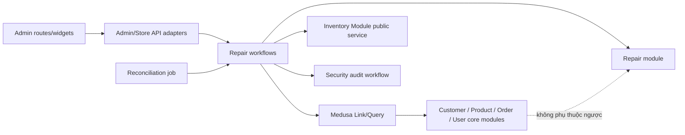

# Thiết kế Repair Service Module

- Phiên bản thiết kế: 06/08/2026
- Nền tảng: Medusa 2.18.0
- Trạng thái: Implemented for internal development; production approval vẫn bị chặn bởi các gate/risk acceptance bảo mật hiện hành

Nguồn yêu cầu được đối chiếu từ `PLAN.md`, phần M09 trong kế hoạch gốc và `docs/next-milestones.md`. Repository không có `docs/modules/M09.md` tại thời điểm triển khai (INDEX vẫn đánh dấu module này chưa học), vì vậy không có nội dung M09 riêng nào được giả định thêm ngoài các nguồn trên.

## 1. Phạm vi và module boundary

`repair` là một bounded context độc lập. Aggregate root là `repair_case`; repair case không phải Order, không dùng Order state machine và không tạo dependency từ Commerce Module về `repair`.

Chiều phụ thuộc:



Quy tắc boundary:

- Module chỉ biết model/service của chính nó. Việc đọc/ghi nhiều module nằm trong workflow.
- API route chỉ validate, authenticate/authorize và chạy workflow hoặc read service/query; route không ghi database trực tiếp.
- Module link đi từ model custom sang model core; không thêm cột hoặc sửa migration core.
- File/ảnh không nằm trong bảng repair. Module chỉ giữ reference và metadata của storage adapter.
- Không cascade-delete repair case khi customer, product, variant hoặc order bị xóa. Link có thể mất nhưng snapshot lịch sử vẫn còn.
- Inventory tiếp tục là nguồn sự thật của tồn kho. Parts usage chỉ điều chỉnh qua Inventory Module dưới distributed-lock abstraction; không tự cập nhật bảng inventory.

## 2. Data ownership

### 2.1. Bảng do Repair Module sở hữu

| Bảng | Mục đích | Tính chất quan trọng |
|---|---|---|
| `repair_case` | Aggregate root, code, trạng thái, SLA, revision và mốc thời gian | `code` unique; status enum; terminal state không mở lại |
| `repair_contact_snapshot` | Contact dùng khi tiếp nhận/tra cứu | PII tách riêng để hạn chế quyền và anonymize theo retention |
| `repair_device_snapshot` | Thiết bị tại thời điểm intake | Không đổi theo Catalog; serial/IMEI chỉ Admin nhạy cảm được xem |
| `repair_diagnosis` | Các phiên bản chẩn đoán | Append version; quote chỉ tham chiếu phiên bản cụ thể |
| `repair_quote` | Báo giá versioned | Draft được sửa; submitted/approved/rejected/superseded là immutable |
| `repair_quote_item` | Snapshot từng dòng service/part/labor/discount | Lưu title/SKU/giá tại thời điểm quote; tổng do server tính |
| `repair_quote_decision` | Bằng chứng approve/reject | Append-only; một quyết định hiệu lực cho mỗi quote |
| `repair_access_token` | Hash capability token cho quote decision | Không lưu raw token; purpose/expiry/consumed_at bắt buộc |
| `repair_part_usage` | Linh kiện thực dùng và trạng thái inventory adjustment | Idempotency key unique; snapshot SKU/title; applied/reversed có audit |
| `repair_technician_assignment` | Lịch sử giao kỹ thuật viên | Giữ user ID reference và display-name snapshot |
| `repair_attachment` | Metadata/reference tới File/storage adapter | Không có blob; classification, checksum, MIME, size, storage reference |
| `repair_status_history` | Lịch sử transition | Append-only ở API; unique idempotency key; from/to đều enum |
| `repair_command_receipt` | Chống replay cho command | Unique command key; request hash khác với cùng key trả conflict |
| `repair_reconciliation_issue` | Sai lệch được job phát hiện | Fingerprint unique cho issue đang mở; resolve thay vì tạo trùng |

Mọi model dùng soft-delete mặc định của DML nhưng các API nghiệp vụ không expose delete cho case, history, diagnosis, quote decision hay part usage.

### 2.2. Reference sang Medusa core

Reference được tạo qua official module link, không tạo foreign key trực tiếp xuyên module:

| Repair model | Core model | Ý nghĩa |
|---|---|---|
| `repair_case` | Customer | Customer đã đăng ký, nếu có; guest vẫn hợp lệ |
| `repair_case` | Product / Product Variant | Thiết bị hoặc SKU gốc, nếu có trong catalog |
| `repair_case` | Order | Nguồn mua/bảo hành tham khảo; không làm case thành Order |
| `repair_technician_assignment` | User | Admin user được giao xử lý |
| `repair_part_usage` | Inventory Item / Stock Location | Nguồn tồn kho thực tế của linh kiện |

Các giá trị `actor_id`, external reference và link ID chỉ là reference. Repair không sở hữu lifecycle của customer/product/order/user/inventory.

### 2.3. Snapshot bắt buộc

- Contact: tên, phone normalized, phone lookup hash và email tại intake. Dữ liệu này có thể anonymize sau retention mà không xóa case.
- Device: device type, brand, model, màu, serial/IMEI, tình trạng nhận máy, phụ kiện bàn giao.
- Catalog: product title, variant title và SKU tại intake.
- Order: display ID, ngày mua và warranty context cần thiết, không copy toàn bộ Order.
- Diagnosis: version và nội dung được quote sử dụng.
- Quote item: loại dòng, mô tả, SKU, quantity, unit price, currency và line total.
- Part usage: inventory item/location reference, SKU/title và quantity thực dùng.
- Technician: display name tại thời điểm assignment.

Snapshot là lịch sử; việc core record đổi tên, archive, anonymize hoặc xóa không được sửa ngược snapshot, trừ quy trình privacy anonymization tường minh.

## 3. RBAC và dữ liệu nhạy cảm

| Actor/role | Xem case | Contact đầy đủ | Diagnosis | Quote | Part usage/cost | Transition chính |
|---|---|---|---|---|---|---|
| Owner | Toàn bộ | Có | Có | Có | Có | Mọi transition hợp lệ |
| Support | Có | Có | Read | Read; ghi nhận hỗ trợ | Không thấy cost nội bộ | Intake, handover, returned, close, early cancel |
| Technician | Có | Masked | Create/read | Create/update draft/submit | Create/reverse usage; thấy dữ liệu kỹ thuật | Diagnose, quote, repair, QA |
| Order & Fulfillment | Có | Có khi bàn giao | Read | Read | Không | Return, returned, close |
| Finance | Metadata | Không | Không | Read amount/decision | Read giá bán, không contact | Không |
| Catalog Manager | Metadata | Không | Không | Read part SKU | Read usage, quản lý inventory qua core | Không |
| Read-only Auditor | Metadata + history | Redacted | Redacted | Read snapshot | Read redacted | Không |
| Public customer | Chỉ serializer công khai sau code+phone hoặc capability token | Chỉ dữ liệu của chính request | Public summary | Quote của case | Không | Create; approve/reject quote |

Policies custom dùng resource/operation cụ thể như `repair_case:read`, `repair_case:transition`, `repair_contact:read_sensitive`, `repair_diagnosis:update`, `repair_quote:submit`, `repair_part_usage:create`, `repair_part_usage:reverse` và `repair_reconciliation_issue:reconcile`. Thêm role Technician không sửa hoặc nới quyền của role Milestone 1.

Admin mutation tiếp tục đi qua MFA step-up hiện có. Repair middleware không thay đổi thứ tự hoặc bypass RBAC/MFA/audit của ADR-002.

## 4. Privacy, PII và retention

PII nhạy cảm:

- Tên, phone, email trong contact snapshot.
- Serial number, IMEI, ảnh tình trạng máy và phụ kiện bàn giao.
- Internal diagnosis có thể tiết lộ dữ liệu trên thiết bị.
- Technician/user identity là dữ liệu nhân sự nội bộ.

Kiểm soát:

- Public serializer không trả internal note, diagnosis chi tiết, cost, inventory ID, technician identity, serial/IMEI đầy đủ hay storage key.
- Audit chỉ ghi case ID/code, transition, amount tổng và ID reference; phone/email/token/serial/IMEI/internal note được redact hoặc không đưa vào payload.
- Phone dùng hash cho lookup; raw phone chỉ tồn tại trong bảng contact để liên hệ và bị policy riêng bảo vệ.
- Attachment private chỉ trả signed URL ngắn hạn qua storage/File adapter ở milestone media; repair chỉ giữ opaque file ID/reference.
- Retention mặc định cho internal development: anonymize contact, serial/IMEI và attachment reference 2 năm sau `closed`/`canceled`; giữ case/status/quote tài chính đã de-identify. Chính sách production cần pháp lý xác nhận trước mở bán.
- Reconciliation job chỉ tạo issue bằng ID và loại lỗi, không copy PII vào payload.

## 5. State machine

Status enum duy nhất:

```text
intake
  -> diagnosis
      -> quote
          -> awaiting_customer_decision
              -> repair                     (approved)
              -> quote                      (expired/revise)
              -> return_ready               (rejected)
                  -> returned -> closed
  -> canceled

repair -> quality_assurance
quality_assurance -> repair                 (rework)
quality_assurance -> return_ready            (passed)
```

`closed` và `canceled` là terminal. Không nhận status text tự do. Customer rejection là một `repair_quote_decision` immutable và transition sang `return_ready`; nó không bị ghi đè thành approval.

### Invariant

1. Mọi status change phải có một dòng `repair_status_history` cùng command/idempotency key.
2. `awaiting_customer_decision` yêu cầu một quote `submitted` với ít nhất một item và tổng do server tính.
3. `repair` yêu cầu quote hiện tại đã `approved`, kể cả quote giá 0 cho warranty.
4. Quote `submitted`, `approved`, `rejected`, `superseded` không được sửa item/amount. Muốn đổi phải tạo revision mới và supersede revision cũ.
5. QA pass yêu cầu checklist/result; QA fail chỉ được quay lại `repair`, không nhảy sang closed.
6. `returned` yêu cầu handover evidence và không còn part usage ở trạng thái `pending`.
7. `closed` yêu cầu đã `returned`; `closed_at` chỉ ghi một lần.
8. `canceled` chỉ hợp lệ trước khi repair bắt đầu; part usage applied phải được reverse trước khi cancel.
9. Một command key chạy lại với cùng request hash trả kết quả cũ; khác hash trả `409 Conflict`.
10. Parts usage applied chỉ được ghi sau khi Inventory Module điều chỉnh thành công; compensation cộng trả đúng quantity nếu workflow rollback.
11. Case revision tăng mỗi transition để phát hiện stale command; lock key là `repair-case:<id>`.

## 6. Transition matrix

| Transition | Actor | Preconditions | Side effects | Audit event | Idempotency | Compensation |
|---|---|---|---|---|---|---|
| create → `intake` | Public, Support, Owner | Contact consent; device snapshot hợp lệ; idempotency key | Tạo case/code, contact, device, history; tạo optional core links | `repair.case.created` | Unique command key + request hash | Xóa aggregate/link vừa tạo nếu workflow sau thất bại |
| `intake` → `diagnosis` | Support, Technician, Owner | Thiết bị đã nhận; assignment tồn tại hoặc actor Owner | Ghi received_at, history, SLA due | `repair.case.diagnosis_started` | Transition key | Khôi phục status/revision/mốc giờ; bỏ history pending |
| `intake` → `canceled` | Support, Owner, Public trước khi nhận máy | Chưa diagnosis/parts; lý do enum | Release appointment/link nếu có; terminal timestamp | `repair.case.canceled` | Transition key | Khôi phục intake nếu side effect ngoài module thất bại |
| `diagnosis` → `quote` | Technician, Owner | Có diagnosis version hoàn chỉnh | Chốt diagnosis version dùng cho quote | `repair.case.diagnosed` | Transition key | Trả status diagnosis |
| `diagnosis` → `canceled` | Support, Owner | Không applied part usage | Terminal; giữ diagnosis lịch sử | `repair.case.canceled` | Transition key | Trả status diagnosis |
| `quote` → `awaiting_customer_decision` | Technician, Owner | Quote draft có item; currency thống nhất; server total; diagnosis version khớp | Freeze quote hash, mark submitted, sinh token hash + expiry | `repair.quote.submitted` | Quote submit key | Revoke token; đưa quote về draft và case về quote |
| `quote` → `canceled` | Support, Owner | Chưa submitted/approved; không part usage | Terminal; giữ draft history | `repair.case.canceled` | Transition key | Trả status quote |
| `awaiting_customer_decision` → `repair` | Customer capability token, Owner | Token đúng scope/chưa hết hạn; quote current/submitted; decision approve | Consume token; append approval; mark quote approved; set approved_at | `repair.quote.approved` | Decision key + unique quote decision | Khôi phục submitted/revoke decision nếu các bước sau thất bại |
| `awaiting_customer_decision` → `return_ready` | Customer capability token, Owner | Cùng kiểm tra token; decision reject | Consume token; append rejection; mark quote rejected; set return due | `repair.quote.rejected` | Decision key + unique quote decision | Khôi phục submitted nếu workflow thất bại |
| `awaiting_customer_decision` → `quote` | Technician, Owner | Quote expired hoặc customer yêu cầu revision; chưa có decision hiệu lực | Supersede quote/token; tạo revision draft mới | `repair.quote.revision_requested` | Revision key | Restore quote/token trước nếu create revision fail |
| `repair` → `quality_assurance` | Technician, Owner | Approved quote; không part usage pending; work summary có | Ghi repair_completed_at; mở QA checklist | `repair.case.qa_started` | Transition key | Trả status repair |
| `quality_assurance` → `repair` | Technician khác hoặc Owner | QA result fail + reason/checklist | Append QA failure; tăng rework count | `repair.qa.failed` | QA key | Trả status QA nếu append audit fail |
| `quality_assurance` → `return_ready` | Technician khác hoặc Owner | QA pass; checklist đủ; due date hợp lệ | Ghi ready_at và public summary đã lọc | `repair.qa.passed` | QA key | Trả status QA |
| `return_ready` → `returned` | Support, Order & Fulfillment, Owner | Handover evidence; pending parts = 0 | Ghi returned_at; revoke access token | `repair.case.returned` | Handover key | Khôi phục return_ready nếu handover workflow fail |
| `returned` → `closed` | Support, Order & Fulfillment, Owner | Device đã giao; quote decision/financial snapshot nhất quán | Ghi closed_at; schedule retention | `repair.case.closed` | Close key | Khôi phục returned nếu finalization fail |

Parts usage và assignment là command trong state, không phải status transition:

| Command | Actor | Preconditions | Side effects | Audit | Idempotency/compensation |
|---|---|---|---|---|---|
| Assign/reassign technician | Support, Owner | Case không terminal; user active | End assignment cũ, append assignment mới | `repair.technician.assigned` | Command key; restore prior assignment nếu fail |
| Add part usage | Technician, Owner | Case `repair`; quantity > 0; inventory item/location tồn tại; available stock đủ | Tạo pending usage; Inventory Module locked adjustment `-quantity`; mark applied | `repair.part.applied` | Usage key; rollback adjustment `+quantity` và xóa pending usage |
| Reverse part usage | Technician, Owner | Usage applied, chưa reversed; case chưa closed | Inventory Module locked adjustment `+quantity`; mark reversed | `repair.part.reversed` | Reversal key; compensation trừ lại nếu local mark fail |

## 7. Reconciliation

Scheduled job chạy theo interval và gọi workflow, không ghi DB trực tiếp. Nó kiểm tra:

- case status khác latest status history;
- quote đã freeze có content hash không khớp;
- part usage còn `pending`;
- terminal case còn active assignment;
- SLA overdue chưa có issue;
- closed/canceled case đến hạn anonymization.

Issue dùng deterministic fingerprint nên job chạy lặp không tạo duplicate. Job chỉ flag và audit; không tự sửa tiền, inventory, quote decision hay transition. Repair action tường minh mới được phép sửa/reverse.

## 8. Extension points Medusa 2.18.0

- DML models và `MedusaService` trong `src/modules/repair`.
- Module registration trong `medusa-config.ts`.
- `defineLink` trong `src/links`; `db:migrate` sync links.
- Workflows/steps trong `src/workflows/repair`; compensation cho side effect.
- File-based Store/Admin routes và `defineMiddlewares` cho validation/auth/RBAC/MFA.
- `definePolicies` cho policy custom.
- Admin UI route và widget trong `src/admin/routes` / `src/admin/widgets`.
- Scheduled job trong `src/jobs` chỉ chạy reconciliation workflow.
- Security audit workflow của ADR-002; không thay đổi schema/module boundary bảo mật.

Nguồn xác minh: tài liệu chính thức về [Modules](https://docs.medusajs.com/learn/fundamentals/modules), [Module Isolation](https://docs.medusajs.com/learn/fundamentals/modules/isolation), [Module Links](https://docs.medusajs.com/learn/fundamentals/module-links), [Workflows](https://docs.medusajs.com/learn/fundamentals/workflows), [Admin UI Routes](https://docs.medusajs.com/learn/fundamentals/admin/ui-routes), [Admin Widgets](https://docs.medusajs.com/learn/fundamentals/admin/widgets) và source/type definitions cài cục bộ của Medusa 2.18.0.
