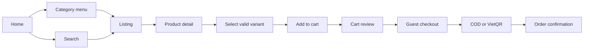
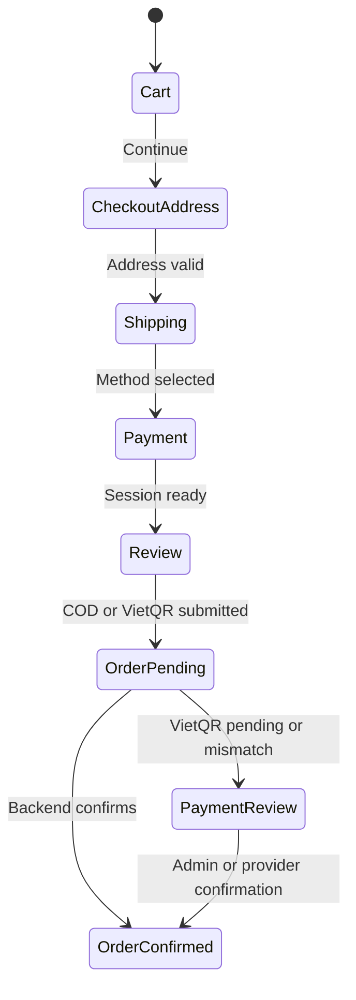

# Storefront user flows

Status: Phase UI-0 specification

The diagrams describe presentation flows only. Pricing, inventory, payment, order, and repair transitions remain owned by the existing Medusa workflows and services.

## Discovery and purchase

Rules:

- The server response is the only source for price, currency, availability, promotion, and totals.
- A selected variant must be represented by the existing `v_id` query behavior and revalidated by the backend.
- Return URLs and receipt uploads never mark VietQR as paid.

## Search and listing

1. Shopper opens the search field or a category.
2. Search input waits for a short debounce, then requests a verified Medusa store query.
3. Suggestions are keyboard navigable and link to the canonical product route.
4. Listing preserves `sortBy`, `page`, and `option_value_id` in the URL.
5. Mobile opens filters in a focus-managed drawer. Closing the drawer preserves the current URL.
6. Empty, error, and out-of-stock results have an explanation and a next action.

## Product detail

1. Show breadcrumb, product name, SKU when supplied, server price, stock state, promotions, and gallery.
2. Choose options. The action button stays disabled until a valid variant is selected.
3. Show shipping, COD, VietQR pending behavior, warranty, and return information from approved policy copy.
4. Add to cart through the existing server action. The client does not calculate totals.

## Cart and checkout

- Guest checkout is first-class. Sign-in is optional and must not block a purchase.
- Checkout labels and validation are Vietnamese, but field names and server actions remain compatible.
- Double submits use the existing pending state and backend idempotency.
- Cart warnings surface stale price, stale stock, and promotion changes returned by the server.

## Order, payment, and repair tracking

- Order tracking accepts an order identifier and only shows data authorized for that customer or staff role.
- VietQR screens show `pending`, `expired`, `manual review`, `confirmed`, `refunded`, and mismatch guidance. The return page is UX only.
- Repair tracking uses a repair case reference and a customer-safe timeline. PII is minimized, snapshots remain historical, and staff-only diagnosis or audit fields are not rendered to customers.

## Failure and recovery states

Every flow needs a stable state for loading, empty, network error, unauthorized, expired, invalid input, out of stock, payment mismatch, and retry. Retry must be idempotent and must not duplicate cart, payment, order, or repair side effects.

## Analytics and privacy

Instrument only non-sensitive interaction events: navigation, search submitted, product viewed, add-to-cart attempted/succeeded, checkout step viewed, and repair tracking opened. Do not send full addresses, phone numbers, payment references, QR payloads, receipt images, diagnosis notes, or audit payloads to analytics.
