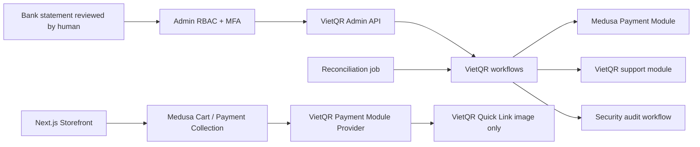

# Thiết kế VietQR Payment

- Phiên bản thiết kế: 06/08/2026
- Nền tảng: Medusa 2.18.0
- Trạng thái: Approved for implementation in internal development
- Loại tích hợp: QR chuyển khoản động, xác nhận thủ công; chưa có provider API/webhook

## 1. Kết quả kiểm tra provider

Workspace không chứa contract API, credential, webhook secret, IP allow-list hoặc tài liệu đối soát của ngân hàng, VietQR API, SePay hay Casso. Các biến môi trường hiện có chỉ phục vụ Medusa, database, CORS và MFA.

Vì vậy milestone này **không** triển khai webhook/polling ngân hàng, không tạo notification giả và không tự đánh dấu paid từ return URL hoặc ảnh biên lai. Backend chỉ dùng Quick Link tạo QR công khai của VietQR để hiển thị mã chuyển khoản; đường link này không phải nguồn xác nhận giao dịch. Khi có contract thật, automated adapter phải được thêm bằng ADR và contract test riêng.

## 2. Provider boundary



### `vietqr-provider`

Payment Module Provider chính thức, đăng ký dưới Payment Module của Medusa:

- Nhận amount/currency/payment-session ID từ Payment Module, không nhận chúng từ storefront làm nguồn sự thật.
- Sinh reference bất biến, expiry, receiver snapshot và QR image URL. `addInfo` luôn chứa reference.
- `initiatePayment` giữ session ở `pending`; `authorizePayment` trả `pending_authorization` cho đến khi có confirmation proof do backend ký.
- `capturePayment`, `cancelPayment` và `refundPayment` là primitive tách biệt. Refund chỉ thành công khi workflow đã ghi nhận giao dịch hoàn tiền thủ công thật.
- Provider không resolve service của module tùy chỉnh, không ghi raw SQL và không chứa business workflow.

### `vietqr` support module

Sở hữu observation, command receipt và reconciliation issue. Module không sở hữu Medusa Payment, Payment Session, Capture, Refund hoặc Order. Tất cả orchestration xuyên module nằm trong workflow.

### Bật provider

Provider mặc định tắt. Chỉ đăng ký khi `VIETQR_ENABLED=true` và cấu hình bank BIN, account number, account name, confirmation secret hợp lệ. Không có account giả hoặc secret mặc định. Region phải bật provider `pp_vietqr_vietqr` sau khi cấu hình.

## 3. Payment state machine

```text
Payment Session
pending
  -> pending_authorization       (order được đặt, chờ kiểm tra sao kê)
  -> canceled                    (hủy trước xác nhận)

pending_authorization
  -> pending_authorization       (under/over/wrong reference: manual review)
  -> authorized                  (exact observation + proof hợp lệ)
  -> canceled                    (hủy khi chưa có tiền, theo workflow hợp lệ)

authorized
  -> captured                    (ghi nhận tiền đã thực nhận; idempotent)

captured
  -> refund pending              (yêu cầu hoàn thủ công; chưa ghi Medusa refund)
  -> refunded/partially refunded (có mã giao dịch hoàn thật + proof hợp lệ)
```

Expiry không tự đồng nghĩa canceled hoặc unpaid: tiền có thể đến muộn. Reconciliation mở issue và Admin phải kiểm tra sao kê trước khi cancel hoặc xử lý late payment.

Observation dùng enum cố định:

- `exact`: amount, currency và reference khớp, còn hạn.
- `underpaid`: số tiền thấp hơn expected.
- `overpaid`: số tiền cao hơn expected.
- `wrong_reference`: nội dung không khớp immutable reference.
- `expired`: giao dịch/kiểm tra diễn ra sau expiry.

Chỉ observation `exact` còn hạn được dùng để confirm. Mismatch không có nút force-paid; phải xử lý nghiệp vụ rồi ghi observation mới có bằng chứng phù hợp.

## 4. Data model bổ sung

| Bảng | Mục đích | Invariant |
|---|---|---|
| `vietqr_transfer_observation` | Snapshot kết quả kiểm tra sao kê | Append-only ở API; enum outcome; expected lấy từ Payment Session; observed do Admin nhập; full receipt image không được lưu |
| `vietqr_manual_refund` | Bằng chứng giao dịch hoàn tiền đã thực hiện ngoài Medusa | Bank transaction reference unique; amount/currency đối chiếu Payment; không lưu ảnh biên lai |
| `vietqr_command_receipt` | Idempotency cho confirm/cancel/refund/reconcile | `(operation, idempotency_key)` unique; cùng key khác request hash trả conflict |
| `vietqr_reconciliation_issue` | Sai lệch session/order/payment/capture/refund | Fingerprint unique cho issue đang mở; job không tự sửa financial state |

Payment Session data của Medusa giữ snapshot công khai cần cho QR: schema version, session ID, reference, expected amount/currency, receiver bank BIN/account/name, expiry, QR image URL và intent hash. Confirmation proof dùng HMAC gắn với session, amount và reference; secret không nằm trong data trả cho storefront hoặc audit log. Refund dùng manual-refund receipt có bank transaction hash và marker idempotent trong Medusa Refund; native refund route bị chặn cho provider này để không ghi refund trước giao dịch ngân hàng thật.

PII/secret:

- Không lưu ảnh biên lai.
- Audit không chứa account number đầy đủ, bank transaction reference đầy đủ, note sao kê, confirmation proof hoặc secret.
- Observation giữ bank transaction reference để vận hành nhưng serializer/audit chỉ trả dạng mask/hash. Retention production phải được duyệt pháp lý; mặc định internal development là 24 tháng rồi pseudonymize reference/note, giữ amount/outcome/hash phục vụ sổ sách.

## 5. Manual confirmation flow

1. Storefront chọn `pp_vietqr_vietqr`; Medusa tạo Payment Session bằng amount/currency server-side.
2. Provider sinh reference từ payment-session ID và secret, snapshot receiver, expiry và Quick Link chứa exact amount/reference.
3. Customer đặt order. `authorizePayment` trả `pending_authorization`; order tồn tại nhưng chưa paid/captured.
4. Finance/Owner mở order, đối chiếu trực tiếp trong ứng dụng ngân hàng và nhập observed amount, currency, transfer content, bank transaction reference cùng idempotency key.
5. Workflow khóa `vietqr:<payment_session_id>`, đọc lại Order/Payment Collection/Payment Session từ Medusa và tự phân loại observation.
6. Nếu mismatch/expired: append observation + reconciliation issue + audit; payment vẫn pending.
7. Nếu exact: tạo confirmation proof HMAC, cập nhật session data qua Payment Module, chạy official authorize-for-order workflow rồi official capture workflow.
8. Command receipt chỉ hoàn tất sau capture. Retry cùng payload trả kết quả cũ; cùng key khác payload trả `409`; capture đã tồn tại không được tạo lần hai.

Cancel và refund là endpoint/workflow riêng. Return page chỉ hiển thị trạng thái đã đọc từ backend, không gọi transition paid.

## 6. Automated reconciliation

Không có bank API nên không có automated payment confirmation. Scheduled job chỉ kiểm tra nội bộ:

- VietQR session hết hạn nhưng còn pending;
- exact observation không có Payment/Capture tương ứng;
- Payment/Capture amount hoặc currency khác session snapshot;
- duplicate bank transaction reference;
- captured payment không có exact observation;
- refund record không có manual refund receipt;
- session data/reference/intent hash bị thay đổi.

Mỗi sai lệch tạo issue fingerprint ổn định và audit event đã redact. Job không authorize, capture, cancel hoặc refund. Runbook tại `docs/runbooks/vietqr-reconciliation.md` quy định cách xử lý.

## 7. Threat model

| Threat | Control |
|---|---|
| Client sửa amount/currency/reference | Bỏ qua các trường trusted từ client; đọc Payment Collection/Session và ký intent server-side |
| Client tự đặt `confirmed=true` | Provider chỉ chấp nhận HMAC proof gắn session/reference/amount/operation |
| Replay/duplicate Admin request | RBAC + MFA, distributed lock, unique receipt, request hash và kiểm tra capture/refund hiện hữu |
| Ảnh biên lai giả | Không upload/lưu/đọc ảnh như bằng chứng; nhân viên kiểm tra sao kê ngân hàng |
| Return URL giả | Không có return transition; trang chỉ đọc state backend |
| Thiếu/thừa/sai nội dung | Enum observation và issue bắt buộc; không force-paid |
| QR hết hạn nhưng tiền đến muộn | Không auto-cancel; reconciliation issue và runbook late-payment |
| Lộ secret/PII qua session/audit | Secret chỉ ở backend; audit redaction; account/transaction reference masked |
| Quick Link bị thay thế/tamper | URL được backend dựng từ snapshot đã hash; storefront không nhận input để dựng lại |
| Provider image outage | Hiển thị fallback bank details/reference; payment vẫn pending, không đổi state |

## 8. Test matrix

| Lớp | Case bắt buộc |
|---|---|
| Unit/provider | VND only; amount integer; immutable deterministic reference; URL encoding; expiry; HMAC constant-time verify; pending authorization; cancel; refund requires captured manual confirmation |
| Unit/workflow | exact/under/over/wrong/expired classification; idempotency same/different hash; duplicate capture; audit redaction |
| Module integration | unique command receipt, duplicate bank transaction reference, append-only observation, issue fingerprint |
| HTTP integration | unauthenticated/role denied/MFA denied; exact confirm; mismatch remains pending; replay; tampered session; cancel/refund separation |
| Reconciliation | expired, missing capture, amount mismatch, duplicate transaction, idempotent rerun; never auto-paid |
| Storefront | provider selection, QR image/fallback details/reference/expiry; place-order button; return/confirmation page does not mutate payment |
| Gates | frozen install, lint, backend/storefront typecheck, unit/module/HTTP tests, backend/Admin/storefront build, Store/Admin smoke, security audit and clean diff |

## 9. Nguồn xác minh

- Medusa 2.18.0 source/type definitions cài trong workspace, đặc biệt `AbstractPaymentProvider`, Payment Module service và core payment workflows.
- Tài liệu chính thức Medusa: Payment Provider, Payment Module options, Payment model và Admin payment flows.
- VietQR Quick Link chính thức: `https://vietqr.io/danh-sach-api/link-tao-ma-nhanh/`. Generate API và Payment Request API cần credential riêng nên không được dùng trong milestone này.
